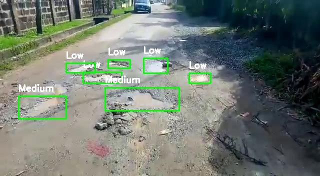

# Pothole Detection with Severity Heuristic

End-to-end computer vision case study for pothole detection in road images and short videos. The project covers dataset preparation, YOLOv12 training, evaluation, inference, reporting, and a Gradio demo for visual inspection.

The detection model predicts a single class: `pothole`. Severity is not learned from labeled severity data. It is estimated as a transparent post-processing heuristic based on bounding box area and vertical position in the image.

> Status: experimental CV case study / prototype.

## Why this project exists

The goal is to demonstrate a practical applied-CV workflow:

- train and evaluate a pothole detector,
- run inference on images and videos,
- attach an interpretable risk/severity label to each detection,
- expose the pipeline through a lightweight demo application,
- document limitations instead of hiding them.

## Current results

| Model | Split | Precision | Recall | mAP50 | mAP50-95 |
|---|---|---:|---:|---:|---:|
| YOLOv12n, 40 epochs, CPU | test | 0.750 | 0.611 | 0.696 | 0.348 |
| YOLOv12n, 100 epochs, CPU | test | 0.818 | 0.723 | 0.779 | 0.445 |

Detailed experiment notes are available in [`docs/experiments.md`](docs/experiments.md).

## Scope and limitations

This is a detection-first prototype. The dataset contains bounding-box annotations for potholes only, without severity labels. Therefore, the current severity output should be read as a heuristic visualization layer, not as a validated road-damage severity model.

A production-grade severity model would require additional labels such as pothole depth, surface area, road context, camera calibration, or expert severity grades.

## Dataset

Source: Roboflow Universe  
Dataset: Pothole Detection Dataset v2  
Format: YOLO-compatible annotations

| Split | Images |
|---|---:|
| Train | 1037 |
| Validation | 296 |
| Test | 149 |
| Total | 1482 |

Initial class configuration:

| Class ID | Class Name |
|---:|---|
| 0 | pothole |

## Demo preview



## Severity heuristic

The current severity label is computed after detection. It combines:

- normalized bounding box area,
- vertical position of the detection in the image.

This is based on a practical assumption: larger potholes closer to the camera are more relevant for visual prioritization. The heuristic is intentionally simple and interpretable.

It is not a substitute for a validated severity model, because the dataset does not contain ground-truth severity labels.

## Goals

- Build a reproducible object detection pipeline for pothole detection.
- Evaluate YOLOv12n on a held-out test split using standard detection metrics.
- Provide image and video inference workflows.
- Add a transparent severity heuristic for visual prioritization.
- Package the project as a small applied-CV prototype with tests, configs, and documentation.

## Installation

This project uses `uv` for Python environment and dependency management.

```bash
uv sync
```

Run Python inside the project environment:

```bash
uv run python --version
```

## Local dataset setup

Before running training, evaluation, prediction, or reports, place the dataset under:

```text
data/pothole_detection_v2/
├── data.yaml
├── train/
│   ├── images/
│   └── labels/
├── valid/
│   ├── images/
│   └── labels/
└── test/
    ├── images/
    └── labels/
```

Datasets are kept local and are not committed to Git.

## Local smoke training

The local smoke training workflow verifies that the dataset, YOLOv12 model initialization, training loop, validation, and weight export work end to end.

Run a minimal CPU-based smoke training:

```bash
uv run python scripts/train_yolov12_smoke.py
```

The default smoke test uses a small configuration:

```text
model: yolov12n.yaml
device: cpu
epochs: 1
image size: 320
batch size: 1
```

On Apple Silicon, MPS is detected, but YOLOv12 training may fail depending on PyTorch and Ultralytics compatibility. CPU smoke training is supported. Full training is recommended on a CUDA-enabled machine.

## Config-driven workflow

Experiment settings are stored in YAML files under:

```text
configs/experiments/
```

Inspect a config:

```bash
uv run python scripts/inspect_experiment_config.py \
  --config configs/experiments/yolov12n_cpu_100e_416_b2.yaml
```

Train from config:

```bash
uv run python scripts/train_yolov12.py \
  --config configs/experiments/yolov12n_cpu_smoke.yaml
```

Evaluate from config:

```bash
uv run python scripts/evaluate_yolov12.py \
  --config configs/experiments/yolov12n_cpu_100e_416_b2.yaml
```

Predict from config:

```bash
uv run python scripts/predict_yolov12.py \
  --config configs/experiments/yolov12n_cpu_100e_416_b2.yaml
```

Generated datasets, weights, logs, runs, reports, predictions, and evaluation outputs are kept local and are not committed to Git.

## Gradio inference app

The project includes a Gradio application for running pothole detection and severity-oriented visualization on images and short videos.

By default, the app expects model weights at:

```text
runs/local_smoke/yolov12_smoke/weights/best.pt
```

Run the app:

```bash
uv run python scripts/run_gradio_app.py
```

Open the local URL printed in the terminal, usually:

```text
http://127.0.0.1:7860/
```

To use a custom model path:

```bash
MODEL_PATH=weights/local/yolov12n_cpu_100e_416_b2_best.pt \
uv run python scripts/run_gradio_app.py
```

The YOLOv12 model detects potholes. Severity labels are estimated using a post-processing heuristic based on bounding box size and vertical position in the image.

## Prediction report

Create a lightweight prediction report from an experiment config:

```bash
uv run python scripts/create_prediction_report.py \
  --config configs/experiments/yolov12n_cpu_100e_416_b2.yaml \
  --max-samples 20
```

The report is saved locally under:

```text
outputs/reports/
```

Generated reports and sample images are not committed to Git.

## Error analysis

The project includes a ground-truth-based error analysis workflow for comparing predictions with YOLO-format labels.

```bash
uv run python scripts/analyze_yolov12_errors.py \
  --config configs/experiments/yolov12n_cpu_100e_416_b2.yaml
```

The analysis reports true positives, false positives, false negatives, precision, recall, F1 score, and matched IoU statistics.

Generated error analysis outputs are saved locally under:

```text
outputs/error_analysis/
```

## Development checks

Run tests:

```bash
uv run pytest
```

Run Ruff linting:

```bash
uv run ruff check .
```

Check formatting:

```bash
uv run ruff format --check .
```
