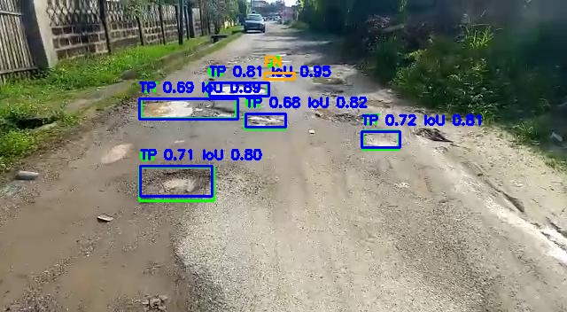
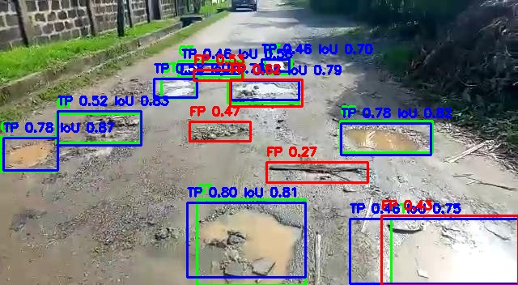

# yolov12n_cpu_100e_plus_60e_416_b2_gentle_aug — experiment report

## Objective

Whether continuing training from the 100-epoch local CPU baseline with gentler
augmentation improves generalisation while preserving the road-texture and
perspective cues that pothole appearance depends on.

## Hypothesis

Reducing aggressive augmentations — mosaic and copy-paste in particular — better
preserves those cues, so recall and localisation-oriented metrics (mAP50,
mAP50-95) improve. Precision may move in either direction.

## Baseline

`yolov12n_cpu_100e_416_b2` — the 100-epoch local CPU model.
Record: [`docs/results/yolov12n_cpu_100e_416_b2_test.eval.yaml`](../results/yolov12n_cpu_100e_416_b2_test.eval.yaml).

| Metric | Baseline (100e) |
|---|---:|
| Precision | 0.8184 |
| Recall | 0.7232 |
| mAP50 | 0.7785 |
| mAP75 | 0.4799 |
| mAP50-95 | 0.4449 |

## Experimental setup

- Model: YOLOv12n, continued from `weights/local/yolov12n_cpu_100e_416_b2_best.pt`.
- Dataset: Roboflow Pothole Detection Dataset v2, `test` split (149 images, 511
  ground-truth boxes).
- Hardware: CPU (Apple M4 Pro).
- Image size 416, batch size 2, 60 additional epochs, seed 0, deterministic.
- Config: `configs/experiments/yolov12n_cpu_100e_plus_60e_416_b2_gentle_aug.yaml`.
- Evaluation record (with package versions):
  [`docs/results/yolov12n_cpu_100e_plus_60e_416_b2_gentle_aug.eval.yaml`](../results/yolov12n_cpu_100e_plus_60e_416_b2_gentle_aug.eval.yaml).

## Change under test

Augmentation only, relative to the Ultralytics defaults used for the baseline:

| Parameter | Baseline (Ultralytics default) | This run |
|---|---:|---:|
| `scale` | 0.5 | 0.25 |
| `mosaic` | 1.0 | 0.2 |
| `mixup` | 0.0 | 0.0 |
| `copy_paste` | 0.0 | 0.0 |

Nothing else changed.

## Results

**Observed** — from the two `docs/results` records, `test` split, image size 416:

| Metric | Baseline (100e) | Gentle aug | Δ |
|---|---:|---:|---:|
| Precision | 0.8184 | 0.8054 | −0.0130 |
| Recall | 0.7232 | 0.7777 | +0.0545 |
| mAP50 | 0.7785 | 0.8356 | +0.0571 |
| mAP75 | 0.4799 | 0.5183 | +0.0384 |
| mAP50-95 | 0.4449 | 0.4902 | +0.0453 |

## Qualitative observations

From the error-analysis run (see below). The evidence in this section is
qualitative — it describes patterns seen in a handful of sample images, not a
quantified distribution.

- **False negatives cluster on small, distant potholes.** In scenes where
  nearby potholes are detected with high IoU, a small pothole further down the
  road is often missed.

  

- **False positives cluster on wet or shadowed road patches** in cluttered
  scenes, typically at low confidence.

  

## Error analysis

`analyze_yolov12_errors.py` over the 149 test images at confidence 0.25,
IoU threshold 0.5, greedy matching against the YOLO-format labels:

| Quantity | Value |
|---|---:|
| Ground-truth boxes | 511 |
| Predicted boxes | 550 |
| True positives | 417 |
| False positives | 133 |
| False negatives | 94 |
| Precision | 0.758 |
| Recall | 0.816 |
| F1 | 0.786 |
| Average matched IoU | 0.800 |

These counts use greedy IoU matching at a single confidence threshold and are
sensitive to both thresholds; they are a diagnostic view, not the primary
metric. The primary metrics are the mAP values in the Results section
(threshold-independent). The diagnostic precision/recall differ from the mAP
precision/recall because they are measured at a fixed operating point rather than
integrated over the precision-recall curve.

## Observed facts

- Recall, mAP50, mAP75, and mAP50-95 all increased relative to the 100-epoch
  baseline; precision decreased by 0.013.
- At confidence 0.25 / IoU 0.5, the model produced 417 true positives, 133 false
  positives, and 94 false negatives over 511 ground-truth boxes; average matched
  IoU was 0.80.

## Interpretation

> Draft — needs owner confirmation

Reducing aggressive augmentations such as mosaic and copy-paste appears to
preserve road texture and perspective context better for this dataset. Under the
recorded evaluation protocol the trade-off — slightly lower precision for higher
recall and better localisation — favoured the fine-tuned model. This is
consistent with the hypothesis; it does not establish a causal claim from a
single comparison.

## Limitations / threats to validity

> Draft — needs owner confirmation

- Small dataset (1482 images total; 149 in the test split).
- Prior test-split exposure: this and earlier experiments used the test split
  during iterative comparison, so this is historical evidence, not a clean final
  test estimate.
- Limited CPU training budget.
- A single run — no variance estimate across seeds.
- No physical pothole-severity ground truth; the severity layer is unaffected by
  this experiment.

## Decision / next step

> Draft — needs owner confirmation

Adopt the gentle-augmentation model as the current local baseline; it is the
default weights file for the Gradio app. Keep the 512-resolution fine-tuning
experiment as a recorded negative result. The next justified step is for the
owner to decide.
